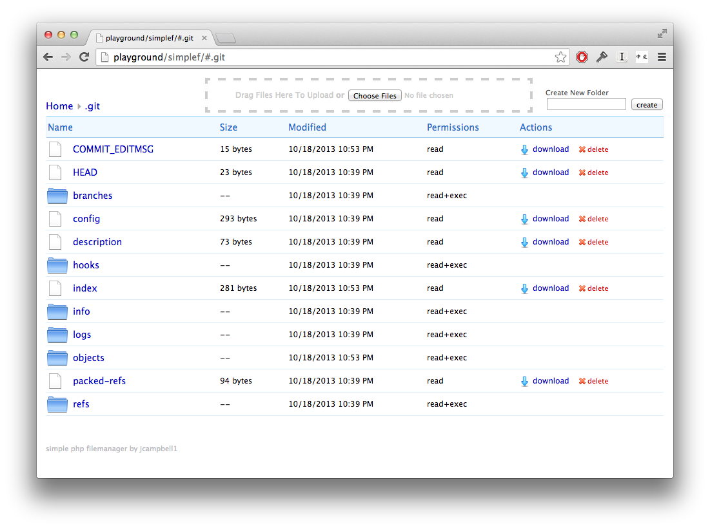

<!--
N.B.: This README was automatically generated by https://github.com/YunoHost/apps/tree/master/tools/README-generator
It shall NOT be edited by hand.
-->

# Simple File Manager for YunoHost

[](https://dash.yunohost.org/appci/app/simple-file-manager)  

[](https://install-app.yunohost.org/?app=simple-file-manager)

*[Lire ce readme en français.](./README_fr.md)*

> *This package allows you to install Simple File Manager quickly and simply on a YunoHost server.
If you don't have YunoHost, please consult [the guide](https://yunohost.org/#/install) to learn how to install it.*

## Overview

A Simple PHP file manager. The code is a single php file.  

### Features

- Single file, there are no images, or css folders.  
- Ajax based so it is fast, but doesn't break the back button
- Allows drag and drop file uploads if the folder is writable by the webserver (`chmod 777 your/folder`)
- Suits my aesthetics.  More like Dropbox, and less like Windows Explorer
- Works with Unicode file names
- The interface is usable from an iPad
- XSRF protection, and an optional password.

**Shipped version:** 1.0~ynh1

## Screenshots



## Documentation and resources

* Upstream app code repository: <https://github.com/jcampbell1/simple-file-manager>
* YunoHost documentation for this app: <https://yunohost.org/app_simple-file-manager>
* Report a bug: <https://github.com/YunoHost-Apps/simple-file-manager_ynh/issues>

## Developer info

Please send your pull request to the [testing branch](https://github.com/YunoHost-Apps/simple-file-manager_ynh/tree/testing).

To try the testing branch, please proceed like that.

``` bash
sudo yunohost app install https://github.com/YunoHost-Apps/simple-file-manager_ynh/tree/testing --debug
or
sudo yunohost app upgrade simple-file-manager -u https://github.com/YunoHost-Apps/simple-file-manager_ynh/tree/testing --debug
```

**More info regarding app packaging:** <https://yunohost.org/packaging_apps>
