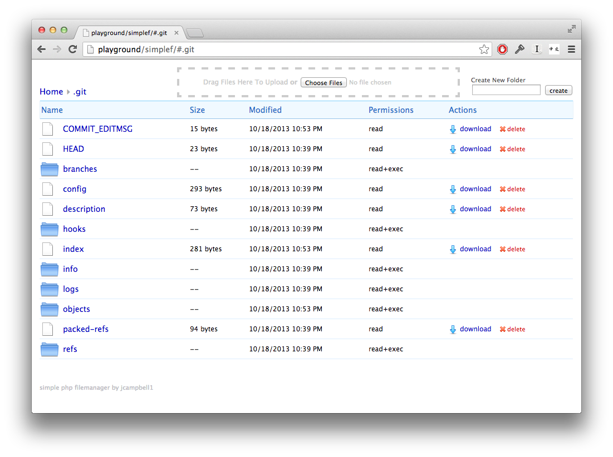

<!--
NOTA: Este README foi creado automáticamente por <https://github.com/YunoHost/apps/tree/master/tools/readme_generator>
NON debe editarse manualmente.
-->

# Simple File Manager para YunoHost

[](https://ci-apps.yunohost.org/ci/apps/simple-file-manager/)  

[](https://install-app.yunohost.org/?app=simple-file-manager)

*[Le este README en outros idiomas.](./ALL_README.md)*

> *Este paquete permíteche instalar Simple File Manager de xeito rápido e doado nun servidor YunoHost.*  
> *Se non usas YunoHost, le a [documentación](https://yunohost.org/install) para saber como instalalo.*

## Vista xeral

A Simple PHP file manager. The code is a single php file.  

### Features

- Single file, there are no images, or css folders.  
- Ajax based so it is fast, but doesn't break the back button
- Allows drag and drop file uploads if the folder is writable by the webserver (`chmod 777 your/folder`)
- Suits my aesthetics.  More like Dropbox, and less like Windows Explorer
- Works with Unicode file names
- The interface is usable from an iPad
- XSRF protection, and an optional password.

**Versión proporcionada:** 1.0~ynh2

## Capturas de pantalla



## :red_circle: Debes considerar

- **Upstream not maintained**: This software is not maintained anymore. Expect it to break down over time, be exposed to unfixed security breaches, etc.

## Documentación e recursos

- Repositorio de orixe do código: <https://github.com/jcampbell1/simple-file-manager>
- Tenda YunoHost: <https://apps.yunohost.org/app/simple-file-manager>
- Informar dun problema: <https://github.com/YunoHost-Apps/simple-file-manager_ynh/issues>

## Info de desenvolvemento

Envía a túa colaboración á [rama `testing`](https://github.com/YunoHost-Apps/simple-file-manager_ynh/tree/testing).

Para probar a rama `testing`, procede deste xeito:

```bash
sudo yunohost app install https://github.com/YunoHost-Apps/simple-file-manager_ynh/tree/testing --debug
ou
sudo yunohost app upgrade simple-file-manager -u https://github.com/YunoHost-Apps/simple-file-manager_ynh/tree/testing --debug
```

**Máis info sobre o empaquetado da app:** <https://yunohost.org/packaging_apps>
